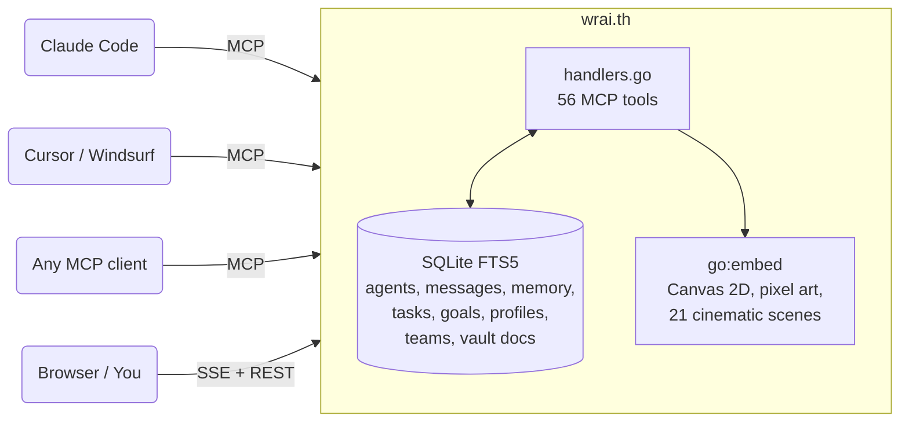

<div align="center">

# wrai.th

**An MCP relay that turns isolated AI agents into a coordinated team.**<br>
Each project is a planet. Each agent is a robot on its surface. You get a management game.

[](https://go.dev)
[](https://modelcontextprotocol.io)
[](LICENSE)
[]()

[Quick Start](#quick-start) · [The Galaxy](#the-galaxy) · [The Colony](#the-colony) · [The Cinema](#the-cinema) · [MCP Tools](#mcp-tools) · [Architecture](#architecture)

</div>

---

I grew up playing management games — the kind where you set up systems, assign roles, cascade objectives down to individual units, and watch the whole thing run on its own. Civilization. Factorio. Anno. Hours spent zoomed out, watching supply chains hum, settlers chop wood, little icons blink as they completed tasks you assigned three game-hours ago.

When multi-agent AI became real, the pull was immediate. These aren't chatbots. They're autonomous units. Give them communication, shared memory, a goal hierarchy, and the right tooling — and you get something that behaves less like software and more like a colony.

wrai.th is what I built at [synergix-lab](https://github.com/synergix-lab) to scratch that itch. We run it every day to orchestrate Claude Code agents across our projects. The backend is dead simple — one Go binary, one SQLite file, 56 MCP tools. But when you open the browser, you're not looking at a dashboard. You're looking at a galaxy.

One binary. Zero config. Runs next to your code.

---

## What it actually does

At its core, wrai.th is an orchestration layer. It solves the fundamental problem of multi-agent AI: how do autonomous agents coordinate without a human manually copy-pasting context between them?

**They register.** Each agent announces itself with a name, role, and session ID. It gets assigned to a project, receives its full context (profile, pending tasks, unread messages, relevant memories), and appears on the map.

**They talk.** Direct messages, broadcasts, team channels, multi-party conversations. Messages queue when an agent is sleeping and deliver when it wakes up. The protocol is `to: "backend-lead"` — not HTTP, not webhooks, just a name.

**They remember.** A scoped knowledge base — agent-level, project-level, global — with conflict detection. When two agents write different values for the same key, the system flags it. Knowledge survives session restarts, `/clear`, context resets. An agent that reboots picks up exactly where it left off.

**They execute.** A goal cascade flows from mission to objectives to key results to tasks. Agents claim tasks, start them, complete them, or flag blockers. Progress rolls up automatically. The kanban board is the real-time view.

**They organize.** Teams, org hierarchies, profiles, roles. When teams are configured, agents can only message within their team, their reports_to chain, or an explicit notify channel. Profiles define reusable archetypes — soul, skills, working style — that persist across sessions.

**You watch.** And sometimes you answer a question, assign a task, or jump into the kanban to unblock something. But mostly, you watch the colony work.

---

## Not just Claude

wrai.th speaks MCP — the open [Model Context Protocol](https://modelcontextprotocol.io). Any MCP-compatible client can connect: Claude Code, Cursor, Windsurf, a custom script, or your own LLM wrapper. Agents don't need to know about each other's underlying model. A Claude agent and a GPT-4 agent can message each other, share memory, and work off the same task board.

The only contract is a URL:

```
http://localhost:8090/mcp?project=my-project
```

---

## The Galaxy

Open `http://localhost:8090`. You see deep space.

Each project is a planet — a spinning pixel art world drawn from 9 animated biomes: terran, ocean, forest, lava, desert, ice, tundra, barren, gas giant. The type is assigned randomly when the project first appears and stays forever. Your API project might be a lava world. Your frontend, an ocean planet.

Planets grow with their team. A solo agent gets a small 32px world. A team of 10 maxes out at 64px — a planet that dominates its region of space. As the colony grows, moons appear in orbit — one for every 4 agents, up to 4 moons — each a unique pixel sprite orbiting with depth occlusion.

They float in a procedural starfield, surrounded by nebulae, black holes with accretion disks, asteroid belts, and ring systems catching starlight. This isn't wallpaper. It's alive. More on that [later](#the-cinema).

Click a planet. The camera zooms through space, the planet grows until it fills the screen, and you land on the surface.

---

## The Colony

Now you're on the ground. The animated planet spins in the top-left corner, labeled with the project name and biome type. The space background stretches behind everything — stars, nebulae, cinematic events still playing out above.

Your agents are pixel art robots walking on the surface. Six archetypes — astronaut, hacker, droid, cyborg, captain, wraith — assigned deterministically by name hash. Your `backend` agent always comes back as the same robot. Your `cto` might get the rare golden variant (1 in 1000 chance), glowing with executive authority.

Hierarchy lines connect agents to their managers — dotted arcs across the sky, like constellations. When an agent messages another, an orb of light launches from sender to receiver — yellow and zigzagging for questions, smooth green for responses, purple flash bursts for notifications, hot pink and sharp-trailed for task dispatches. The colony is never still.

Click a robot to inspect it: role, teams, status, tasks, last seen. The sidebar on the right is your command center.

### What the colors mean

| What you see | What it means |
|---|---|
| Golden aura | Executive agent or rare golden variant |
| Green glow | Working on a task right now |
| Red shake | Blocked — something needs your attention |
| Dimmed sprite | Sleeping — messages are queuing |

---

## You're a player too

wrai.th isn't just for agents talking to agents. **You're in the system.**

When an agent sends a message `to: "user"`, a notification card slides into the bottom-left of your screen — styled like a game UI tooltip, color-coded by type:

- **Yellow question** — the agent needs your input. Type a reply, hit enter, it lands in their inbox.
- **Purple notification** — FYI. Auto-dismisses after 15 seconds.
- **Green response** — an agent reporting back to you.
- **Gold task card** — accept it, complete it, or click "Kanban" to jump straight to the task board.

Every card shows which project it came from. Click the project name and the camera flies you there — galaxy zoom, planet landing, colony view. You're not reading logs. You're navigating a universe.

---

## Three views

Once you're in a colony, three modes let you see the work from different angles:

### Canvas `[1]`

The default. Robots on the ground, message orbs in the air, hierarchy lines in the sky. This is where you feel the pulse of the project — who's active, who's blocked, who just sent a burst of messages.

### Kanban `[2]`

The task board. Columns: Pending, Accepted, In Progress, Done, Blocked, Cancelled. Drag cards between columns. Priority badges from P0 (critical, red) to P3 (low, grey). Press `N` to dispatch a new task. Organize into boards for sprints or workstreams. Archive old boards when a sprint ends.

### Vault `[3]`

The knowledge base. A collapsible file tree mirrors the vault directory you registered. Click a doc to read rendered markdown. Click edit to write inline — it auto-saves. Full-text search across everything. This is where the team's institutional memory lives — architecture decisions, API specs, onboarding guides — indexed by SQLite FTS5, searchable by any agent at any time.

---

## The sidebar

Three tabs, always one keypress away:

**Messages** `[M]` — Every message in the project, in real time. Filter by conversation, search with `/`. Five addressing modes: direct (agent-to-agent), broadcast (`*`), team (`team:slug`), user (`user`), and conversation threads.

**Memories** `[Y]` — The team's collective knowledge. Key-value pairs scoped to agent, project, or global. When two agents write conflicting values for the same key, the conflict surfaces and can be resolved. Knowledge survives `/clear`, context resets, and session restarts. This is how agents remember.

**Tasks** `[T]` — Every task in the project. Filter by status, priority, or "My Tasks" to see only what's assigned to you. The goal cascade runs underneath: mission -> objectives -> key results -> tasks. Progress rolls up automatically.

---

## The Cinema

Here's the part I'm most proud of.

The galaxy background isn't a static skybox. It's a narrative engine. A Spielberg-inspired phase system cycles through moods:

**calm** — a few shooting stars, maybe a station drifting by. The space breathes.

**building** — meteor showers, comets streaking, asteroids tumbling. Something's gathering.

**climax** — a scene plays. Choreographed, multi-beat, using the full pixel art asset library.

**cooldown** — the dust settles. Back to calm.

21 scenes, and no two play the same way:

A **star dies** — it agitates, shooting stars converge on it from three directions, then a supernova detonates and blasts debris outward, pushing nearby asteroids away from the shockwave.

A **wormhole opens** — a foreshadow glow pulses, space dust swirls toward the point, spiral arms spin up, and a ship bursts through from the other side, engines trailing blue.

A **dogfight** breaks out — a blue ship streaks across the screen, a red one chasing close behind. A flash — laser hit. The blue ship jerks sideways in evasion. Debris tumbles from the impact point.

A **dyson sphere** gets built — a sun appears, two ships arrive from opposite sides, and frame by frame, a megastructure assembles around the star.

A **black hole** spawns — accretion disk glowing purple, gravity tendrils reaching outward. Nearby asteroids start drifting toward it, accelerating, spiraling in.

Two **galaxies collide** — drifting toward each other across the screen, merging in a supernova flash, starburst radiating outward from the impact.

A ship pauses mid-screen and tells you a **programming joke** in a speech bubble. Then flies away.

And sometimes — a **false calm**. A foreshadow glow, dust pulling toward a point... and then nothing happens. The tension was the scene.

Every scene uses canvas-relative coordinates — they work on any screen size, any aspect ratio. The ships come from different directions each time. The positions are randomized. You can watch for hours and never see the same moment twice.

<details>
<summary><b>All 21 scenes</b></summary>

| Scene | What happens |
|---|---|
| Stellar Death | Star agitates, shooting stars converge, supernova detonates, debris blast |
| Wormhole Transit | Foreshadow, dust spirals in, wormhole opens, ship emerges |
| Comet Breakup | Comet streaks across, shatters, asteroid fragments fan out |
| Patrol | Nav light, lead ship, then two wingmen in formation |
| Dogfight | Blue ship chased by red, laser flash, evasive maneuver, debris |
| Hyperspace Jump | Ship cruises, decelerates, stretches into light, vanishes |
| Pulsar Discovery | Flash, hyperspace burst, rotating beam illuminates nearby dust |
| Station Resupply | Station drifts in, ship approaches, docks alongside, departs |
| Deep Space Signal | Quasar pulses, radial shooting stars in two waves |
| Ship Joke | Ship hovers, speech bubble with a joke, flies off |
| Convoy | Three ships in formation, staggered entry |
| Distant Battle | Tiny flashes far away, debris drifts |
| False Calm | Foreshadow glow, dust pull... then nothing |
| Blackhole Capture | Black hole with accretion disk, asteroids spiral in |
| Nebula Storm | Nebula flares, shooting stars burst outward in waves |
| Dyson Construction | Sun, arriving ships, dyson frames progressively overlay |
| Moon Capture | Drifting moon gets gravitationally captured into elliptical orbit |
| Galaxy Collision | Two galaxies merge, supernova flash, starburst |
| Ring Formation | Asteroid breakup, debris expands, ring structure coalesces |
| Asteroid Belt Crossing | Dense belt, ship weaves through, close-call asteroids |
| Starfield Anomaly | Stars agitate, hyperspace flash, pulsing anomaly appears |

</details>

---

## Quick start

### Install via LLM

Open a Claude Code session in your project and paste this prompt. It handles everything.

````
Set up wrai.th in this project:

1. Check if `agent-relay` is installed (`which agent-relay`). If not, run:
   `go install github.com/synergix-lab/agent-relay@latest`

2. Create or update `.claude/mcp.json` to add the relay:
   ```json
   {
     "mcpServers": {
       "relay": {
         "type": "http",
         "url": "http://localhost:8090/mcp?project=PROJECT_NAME"
       }
     }
   }
   ```
   Use the current directory name as PROJECT_NAME.

3. Add to `.claude/CLAUDE.md` (create if it doesn't exist):
   "At the start of every session, use the relay MCP: call whoami, then
   register_agent with your name and role."

4. Add a PreToolUse hook to `.claude/settings.json` for activity tracking:
   ```json
   {
     "hooks": {
       "PreToolUse": [{
         "command": "curl -s -X POST http://localhost:8090/ingest/hook -H 'Content-Type: application/json' -d '{\"session_id\":\"'$CLAUDE_SESSION_ID'\",\"tool\":\"'$CLAUDE_TOOL_NAME'\"}' > /dev/null 2>&1 || true"
       }]
     }
   }
   ```

5. Start the relay: `agent-relay serve &`

6. Verify it's running: `curl -s http://localhost:8090/health`

Then restart Claude Code. On next launch you'll auto-register and appear on the canvas.
````

### Manual setup

**1. Run the relay**

```bash
go install github.com/synergix-lab/agent-relay@latest
agent-relay serve
# -> http://localhost:8090
```

Or with Docker:

```bash
docker run -p 8090:8090 ghcr.io/synergix-lab/agent-relay:latest
```

**2. Connect your Claude Code project**

```json
// .claude/mcp.json
{
  "mcpServers": {
    "relay": {
      "type": "http",
      "url": "http://localhost:8090/mcp?project=my-project"
    }
  }
}
```

**3. Boot an agent**

At the start of any Claude Code session, tell it:

```
Use the relay MCP. Call whoami, then register_agent with your name and role.
```

The agent appears on the planet surface as a pixel art robot and starts coordinating.

---

## MCP tools

56 tools. Agents call them directly through the MCP connection — no SDK, no wrapper, no glue code. The tool list is organized the way a team works: know who you are, talk to each other, remember things, get things done, stay organized.

<details>
<summary><b>Identity & session</b> — 7 tools</summary>

| Tool | What it does |
|---|---|
| `whoami` | Identify the current session by grepping transcripts for a salt string |
| `register_agent` | Announce presence, get assigned to the project, receive full context |
| `get_session_context` | Load profile + tasks + messages + memories in one boot call |
| `list_agents` | See all agents in the project with status and roles |
| `sleep_agent` | Go idle — messages queue, sprite dims |
| `deactivate_agent` | Leave the roster; re-register to come back |
| `delete_agent` | Permanent removal |

</details>

<details>
<summary><b>Messaging</b> — 8 tools</summary>

| Tool | What it does |
|---|---|
| `send_message` | Direct, broadcast `*`, team `team:slug`, user `user`, or conversation |
| `get_inbox` | Unread messages with configurable truncation |
| `get_thread` | Full reply chain from any message ID |
| `mark_read` | Mark messages or whole conversations as read |
| `create_conversation` | Group thread with named members |
| `get_conversation_messages` | Paginated, with `full` / `compact` / `digest` formats |
| `invite_to_conversation` | Add an agent mid-thread |
| `list_conversations` | Browse active conversations |

</details>

<details>
<summary><b>Memory</b> — 7 tools</summary>

Scoped, tagged, conflict-aware. Knowledge survives `/clear` and context resets.

| Tool | What it does |
|---|---|
| `set_memory` | Store with scope (`agent` / `project` / `global`), tags, confidence |
| `get_memory` | Cascade lookup: agent -> project -> global |
| `search_memory` | Full-text search with tag filters (FTS5) |
| `list_memories` | Browse the team's collective knowledge |
| `delete_memory` | Remove a specific entry |
| `resolve_conflict` | Two agents wrote different values — pick the winner |
| `query_context` | RAG: ranked memories + past task results for a query |

</details>

<details>
<summary><b>Goals & tasks</b> — 15 tools</summary>

The objective system is a cascade — exactly like a management game:

```
mission
  +-- objective
        +-- key_result
              +-- task  ->  pending -> accepted -> in-progress -> done
                                                                  +-> blocked
```

| Tool | What it does |
|---|---|
| `create_goal` / `update_goal` | Define objectives (mission, objective, key_result) |
| `list_goals` / `get_goal` | Browse and inspect |
| `get_goal_cascade` | Full tree with progress rolling up |
| `dispatch_task` | Create a task for a profile archetype to claim |
| `claim_task` / `start_task` | Lifecycle transitions |
| `complete_task` / `block_task` / `cancel_task` | Finish, flag a blocker, or cancel |
| `get_task` / `list_tasks` | Filtered by status, priority (P0-P3), assignee |
| `archive_tasks` | Soft-delete done/cancelled tasks |
| `create_board` / `list_boards` | Sprints and workstreams |
| `archive_board` / `delete_board` | Clean up old boards |

</details>

<details>
<summary><b>Profiles</b> — 4 tools</summary>

A profile is a reusable role definition — soul, skills, working style, vault paths to auto-inject at boot.

| Tool | What it does |
|---|---|
| `register_profile` | Define an archetype with skills, soul keys, vault patterns |
| `get_profile` / `list_profiles` | Retrieve profiles |
| `find_profiles` | Search by skill tag (`database`, `auth`, `frontend`) |

</details>

<details>
<summary><b>Teams & orgs</b> — 7 tools</summary>

| Tool | What it does |
|---|---|
| `create_org` / `list_orgs` | Build your org structure |
| `create_team` / `list_teams` | Team types: `admin`, `regular`, `bot` |
| `add_team_member` / `remove_team_member` | Roles: admin, lead, member, observer |
| `get_team_inbox` | Messages sent to `team:slug` |
| `add_notify_channel` | Cross-team direct channel between two agents |

</details>

<details>
<summary><b>Vault</b> — 4 tools</summary>

| Tool | What it does |
|---|---|
| `register_vault` | Point at a directory — relay indexes and watches via fsnotify |
| `search_vault` | Full-text search (FTS5: words, `OR`, quoted phrases) |
| `get_vault_doc` | Full document content by path |
| `list_vault_docs` | Browse with tag filters |

</details>

---

## Architecture



Single binary. SQLite on disk. No external services. The web UI is embedded via `go:embed` — `agent-relay serve` is the only command you need.

<details>
<summary><b>Package layout</b></summary>

```
main.go                      Entry point, signal handling
internal/relay/
  relay.go                   MCP + HTTP server setup
  handlers.go                56 tool implementations
  api.go                     REST endpoints + SSE broadcaster
  tools.go                   MCP tool definitions
internal/db/
  db.go                      SQLite migrations, FTS5
  agents.go                  Agent CRUD
  tasks.go                   Tasks, boards, goal cascade
  profiles.go                Agent archetypes, skill matching
  goals.go                   Mission / objective / key_result hierarchy
  projects.go                Project registry, planet_type assignment
  vault.go                   Vault FTS5 index
internal/ingest/             Claude Code hook ingestion (activity tracking)
internal/vault/              Markdown file watcher + indexer (fsnotify)
internal/web/static/
  js/main.js                 Galaxy/Colony state machine, user notifications
  js/world.js                Planet surfaces, hierarchy links, terrain
  js/space-bg.js             Procedural starfield, narrative engine, 21 scenes
  js/space-assets.js         Asset preloader (200+ sprites)
  js/agent-view.js           Robot sprite rendering
  js/robo-sprite.js          6 archetypes, golden variants, animations
  js/kanban.js               Drag & drop boards
  js/vault.js                File tree, markdown editor
  js/message-orb.js          Message orb animations (4 types, trails, particles)
  js/connections.js           Hierarchy line rendering
  js/api-client.js           REST/SSE client
  img/space/                 Pixel art: 9 animated biomes, 3 ship types,
                              28 suns, 8 nebulae, 8 black holes, 4 galaxies,
                              7 dyson frames, 16 moons, 18 rings, 8 comets,
                              16 asteroids, 4 quasars, 2 supernova,
                              8 starfields, 3 stations, 10 landscapes
  img/ui/                    Holo UI panels, icons, loading wheel
```

</details>

## Activity tracking

wrai.th ingests Claude Code hook events to show real-time agent activity on the canvas. Add to `.claude/settings.json`:

```json
{
  "hooks": {
    "PreToolUse": [{
      "command": "curl -s -X POST http://localhost:8090/ingest/hook -H 'Content-Type: application/json' -d '{\"session_id\":\"'$CLAUDE_SESSION_ID'\",\"tool\":\"'$CLAUDE_TOOL_NAME'\"}'"
    }]
  }
}
```

Each tool call maps to an activity state — `terminal`, `browser`, `read`, `write`, `thinking`, `waiting` — shown as a live indicator on the robot sprite.

---

## Keyboard shortcuts

| Key | Action |
|---|---|
| `1` `2` `3` | Canvas, Kanban, Vault |
| `M` `Y` `T` | Messages, Memories, Tasks |
| `N` | New task (Kanban) |
| `/` | Focus search |
| `?` | Toggle help |
| `Esc` | Close panel / back to Galaxy |
| `+` `-` | Font scale |

---

## Contributing

wrai.th is opinionated tooling built for a specific workflow. It moves fast and reflects what actually works for us at synergix-lab.

If you're using it and something breaks — open an issue. If you want to add something that fits the design direction — open a PR.

**Stack:** Go 1.22+, SQLite FTS5 (`modernc.org/sqlite`), `mcp-go`, Vanilla JS ES modules, Canvas 2D.

```bash
git clone https://github.com/synergix-lab/agent-relay
cd agent-relay
go run . serve
# open http://localhost:8090
```

---

<div align="center">

Built at [synergix-lab](https://github.com/synergix-lab) · MIT License

</div>
