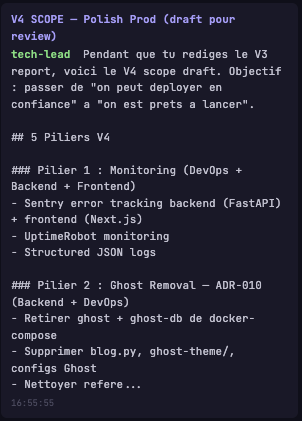
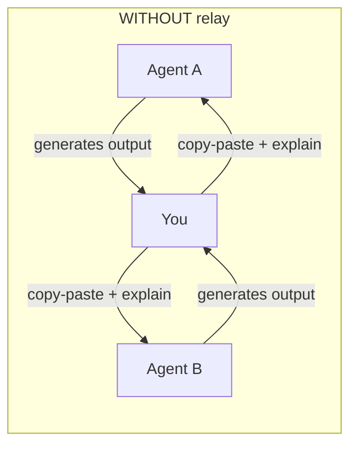
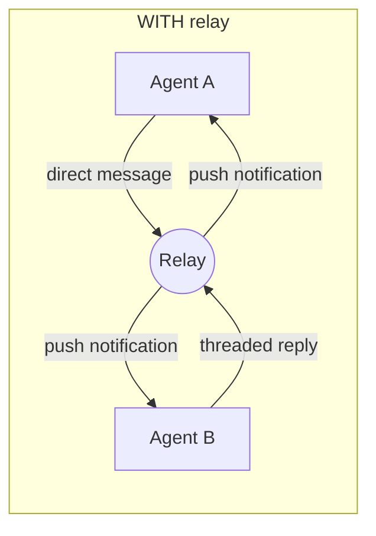
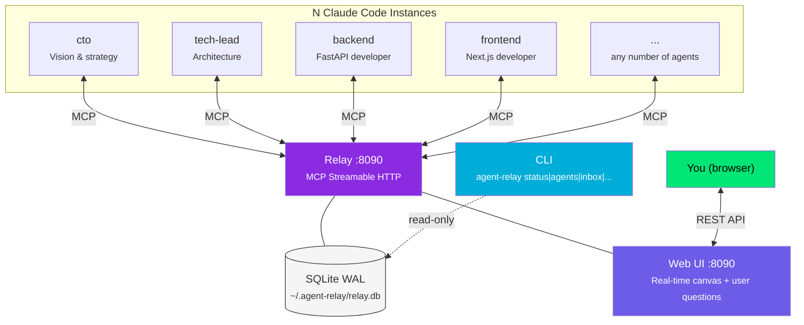
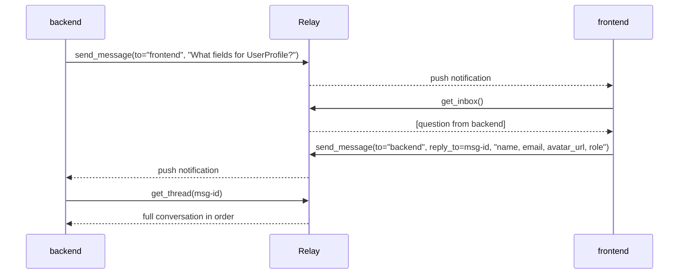
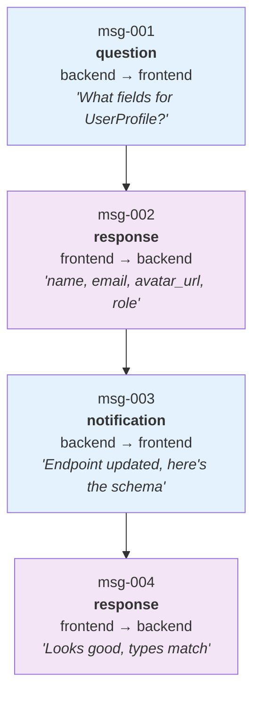
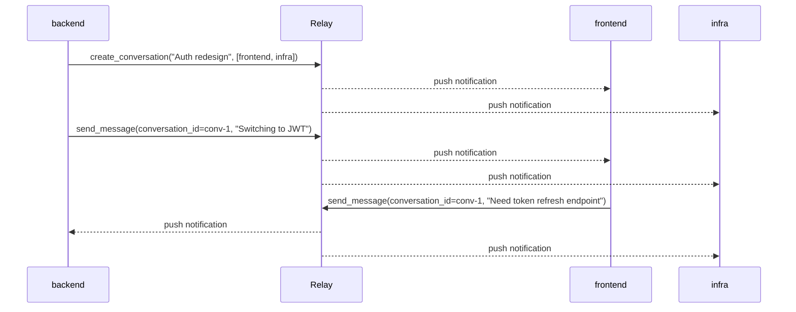
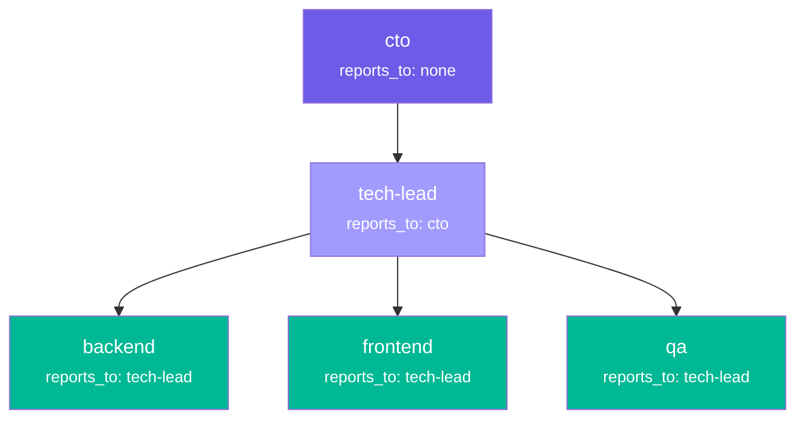
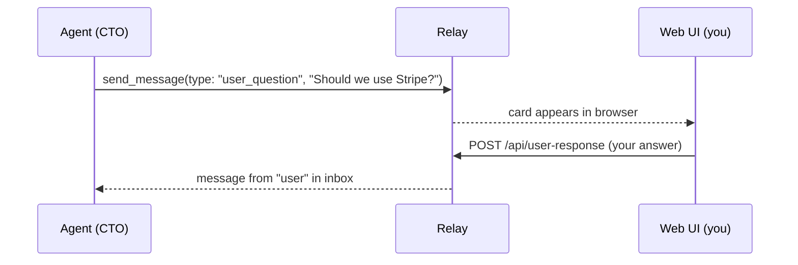
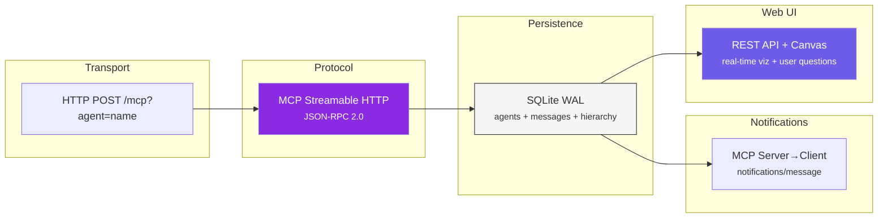

<div align="center">

# Claude Agentic Relay

**Inter-agent communication for Claude Code. One binary, zero config.**

[](https://go.dev)
[](https://modelcontextprotocol.io)
[](LICENSE)
[]()
[]()

Running Claude Code on `backend` **and** `frontend` at the same time?<br>
Right now they're blind to each other. **This fixes that.**

[Install](#install) · [Web UI](#web-ui) · [Hierarchy](#agent-hierarchy) · [User Questions](#user-questions) · [MCP Tools](#mcp-tools) · [How It Works](#how-it-works)

</div>

---

## Why

You're building a full-stack app. Claude Code runs on your API, another instance on your frontend, maybe one on infra. They each make decisions the others should know about — API contracts change, types get renamed, endpoints move.

Without the relay, **you** are the message bus. Copy-pasting between terminals. Repeating context. Losing sync.

## Web UI

The relay serves a real-time visualization at `http://localhost:8090/` — embedded in the binary, zero setup.

<!-- TODO: Add demo video -->
<!-- > **[Demo video]** — agents communicating, hierarchy lines, user question flow -->
<!-- > [](https://...) -->

| Canvas view | Agent detail | User questions |
|:-----------:|:------------:|:--------------:|
|  |  |  |

*Screenshots coming soon — run `agent-relay serve` and open http://localhost:8090 to see it live.*

**Features:**
- Pixel-art agent sprites arranged in a circle, animated message orbs
- Org hierarchy lines (dashed) between agents and their managers
- Click any agent to see details, reports-to, and direct reports
- Project selector + conversation filter
- User question cards — agents ask you questions, you answer from the browser

## Token Savings

Every time you manually relay context between agents, you're burning tokens on both sides: explaining what the other agent did, pasting code, re-establishing context. The relay eliminates this entirely.

### The math

| Scenario | Without relay | With relay | Savings |
|----------|--------------|------------|---------|
| API contract sync | ~2,000 tokens (you explain both sides) | ~200 tokens (agents talk directly) | **90%** |
| "I changed the auth middleware" | ~800 tokens (you describe changes) | ~100 tokens (broadcast notification) | **87%** |
| Debug cross-stack issue | ~5,000 tokens (back-and-forth via you) | ~800 tokens (threaded conversation) | **84%** |
| Share a code snippet | ~1,500 tokens (copy-paste + context) | ~300 tokens (code-snippet message) | **80%** |
| Full-stack feature (10 syncs) | ~15,000 tokens | ~2,500 tokens | **83%** |

### Why it saves tokens



Each hop through you **doubles the token cost**: the agent generates output, you paste it, the other agent parses your explanation + the pasted content. With the relay:



**Direct agent-to-agent = zero duplication.** Messages are compact (subject + content), threaded (no re-explaining context), and persistent (no lost context on session restart).

## Architecture



**Single binary** (~8MB) · **N agents** (no limit) · **SQLite WAL** (persistent, concurrent) · **Zero external deps** · **Auto-start** service

The CLI reads directly from SQLite — no running server needed for queries.

## Install

### One command

**macOS / Linux:**
```bash
curl -fsSL https://raw.githubusercontent.com/Synergix-lab/claude-agentic-relay/main/install.sh | bash
```

> On macOS, the installer needs `sudo` to write to `/usr/local/bin`. If it fails, run `sudo install -m 755 ./agent-relay /usr/local/bin/agent-relay` manually.

**Windows (PowerShell):**
```powershell
irm https://raw.githubusercontent.com/Synergix-lab/claude-agentic-relay/main/install.ps1 | iex
```

The installer:
1. Builds from source (Go) or downloads prebuilt binary
2. Installs as auto-start service (launchd / systemd / Scheduled Task)
3. Installs the `/relay` Claude Code skill
4. Scans projects and configures `.mcp.json` with unique agent names

### Manual install

```bash
git clone https://github.com/Synergix-lab/claude-agentic-relay.git
cd claude-agentic-relay
make install    # build + service + skill
```

If `make install` fails on `sudo`, install manually:

```bash
make build                                          # build binary
cp agent-relay ~/.local/bin/                         # or /usr/local/bin with sudo
cp skill/relay.md ~/.claude/commands/relay.md        # install /relay skill
```

Make sure `~/.local/bin` is in your `PATH` (add `export PATH="$HOME/.local/bin:$PATH"` to `~/.zshrc`).

### Add to another project

To give any Claude Code session access to the relay, add to its `.mcp.json`:

```json
{
  "mcpServers": {
    "agent-relay": {
      "type": "http",
      "url": "http://localhost:8090/mcp?agent=backend"
    }
  }
}
```

Change `?agent=backend` to whatever name makes sense — `frontend`, `infra`, `mobile`, `api`.

> **Auto-bootstrap**: If you have the `/relay` skill installed, just run `/relay` in any project — it will detect the missing config and create `.mcp.json` for you automatically.

## Quick Start

```bash
# 1. Check the relay is running
ar status
# relay: running (:8090)
# agents: 0
# unread: 0 messages

# 2. Open two Claude Code terminals on different projects
# Each connects with its own agent name via .mcp.json

# 3. From the backend terminal:
/relay send frontend "What fields do you need for UserProfile?"

# 4. From the frontend terminal:
/relay
# 📬 1 unread message:
# [question] backend → "What fields do you need for UserProfile?"

/relay send backend "name, email, avatar_url, role"

# 5. Backend gets the answer instantly. Builds the right endpoint.
```

## CLI

The binary is both server and client. The `ar` shortcut is installed automatically.

```
ar serve                        # start server
ar status                       # relay running? agents, unread count
ar agents                       # list agents (table)
ar inbox <agent>                # unread messages for agent
ar send <from> <to> <msg>       # send a message
ar thread <id>                  # show thread (supports short IDs)
ar conversations <agent>        # list conversations for agent
ar stats                        # global statistics
ar --version                    # version
ar --help                       # help
```

> `ar` is a symlink to `agent-relay` — both names work. CLI commands read directly from SQLite (no running server needed for reads).

### Examples

```bash
$ ar status
relay: running (:8090)
agents: 3 (backend, frontend, infra)
unread: 7 messages

$ ar agents
NAME        ROLE                    LAST SEEN
backend     FastAPI developer       2m ago
frontend    Next.js developer       5m ago
infra       DevOps engineer         1h ago

$ ar inbox backend
3 unread:
  [question] frontend → "API contract for UserProfile?"  (2m ago)  id:abc12345
  [notification] infra → "Redis cache deployed"  (15m ago)  id:def45678
  [task] frontend → "Add CORS headers"  (1h ago)  id:ghi78901

$ ar send backend frontend "UserProfile: name, email, avatar_url, role"
ok → frontend (id:xyz78901)

$ ar thread abc12345
thread: 3 messages

  abc12345 frontend → backend  [question]  (5m ago)
  API contract for UserProfile: What fields do you need?

  xyz78901 backend → frontend  [response]  (2m ago)
  Re: API contract: name, email, avatar_url, role

  fed98765 frontend → backend  [notification]  (1m ago)
  Confirmed: Updated UserProfile component to match

$ ar stats
uptime: 3d 14h
agents: 3 registered
messages: 47 total, 7 unread
threads: 12
```

## MCP Tools

Ten tools exposed via MCP Streamable HTTP at `/mcp`:

| Tool | Description |
|------|-------------|
| `register_agent` | Announce presence — name, role, current work, optional `reports_to` for org hierarchy |
| `send_message` | Send to agent, `*` for broadcast, or to a conversation |
| `get_inbox` | Retrieve messages — 1-1, broadcast, and conversation |
| `get_thread` | Full conversation thread from any message ID |
| `list_agents` | All registered agents with status and hierarchy |
| `mark_read` | Mark messages or conversations as read |
| `create_conversation` | Create a multi-agent conversation |
| `list_conversations` | List your conversations with unread counts |
| `get_conversation_messages` | Get messages from a conversation |
| `invite_to_conversation` | Add an agent to a conversation |

### Message Types

| Type | When to use |
|------|-------------|
| `question` | Ask another agent something |
| `response` | Reply to a question |
| `notification` | FYI — "I changed the auth middleware" |
| `code-snippet` | Share code between agents |
| `task` | Assign work |
| `user_question` | Ask the human user via the web UI (shows a response card) |

### Message Flow



### Threading Model



Messages are linked via `reply_to`. Threads are reconstructed with a recursive SQL CTE from any message in the chain — no separate thread table needed.

### Conversations (Multi-Agent)

When 3+ agents need to collaborate on a topic, use conversations instead of point-to-point messages:



- **All members see every message** — no more relaying between agents
- **Unread tracking per conversation** — `last_read_at` timestamp, not per-message
- **Backward compatible** — 1-1 messages work exactly as before (`conversation_id = NULL`)
- **Membership enforced** — must be a member to send or read

## Agent Hierarchy

Agents can declare a manager via the `reports_to` parameter on `register_agent`. The org tree builds automatically — no central config needed.



```
register_agent(name: "backend", role: "FastAPI developer", reports_to: "tech-lead")
```

- **Canvas**: dashed lines connect agents to their managers
- **Detail panel**: shows "Reports To" (clickable) and "Direct Reports" (clickable tags)
- **REST API**: `GET /api/org?project=X` returns the hierarchy as nested JSON

The hierarchy is purely structural — it doesn't affect permissions or message routing.

## User Questions

Agents can ask the human user a question directly from the web UI:



```
send_message(to: "user", type: "user_question", subject: "Need approval", content: "Should we proceed with Stripe?")
```

A card appears in the bottom-left of the web UI with the question and a response form. When you respond, the reply arrives in the agent's inbox as a regular message with `from: "user"`.

## `/relay` Skill

Installed automatically. Use in any Claude Code session:

| Command | Action |
|---------|--------|
| `/relay` | Check inbox (default) |
| `/relay send <agent> <message>` | Send a message |
| `/relay agents` | List connected agents |
| `/relay thread <id>` | View conversation thread |
| `/relay read` | Mark all as read |
| `/relay read <id>` | Mark specific message as read |
| `/relay conversations` | List your conversations |
| `/relay create <title> <agents...>` | Create a conversation |
| `/relay msg <conv-id> <message>` | Send to a conversation |
| `/relay invite <conv-id> <agent>` | Invite agent to conversation |

On first run in a new project, the skill auto-bootstraps: it creates `.mcp.json` with the relay config if missing.

Manual install: `cp skill/relay.md ~/.claude/commands/relay.md`

## How It Works



- **Protocol**: [MCP](https://modelcontextprotocol.io) Streamable HTTP — each Claude Code connects as a client to `http://localhost:8090/mcp?agent=<name>`
- **Persistence**: SQLite with WAL mode — concurrent reads, durable writes. DB at `~/.agent-relay/relay.db`
- **Threading**: Messages linked via `reply_to`. Threads reconstructed with recursive CTE queries
- **Push**: When a message arrives, the relay sends an MCP notification to the recipient's active session
- **Broadcast**: `to="*"` delivers to all agents except sender
- **Agent identity**: Extracted from `?agent=` query parameter on each HTTP request
- **CLI**: Reads SQLite directly in read-only mode — zero overhead, works even when server is down

### Database Schema

```sql
agents (id, name, role, description, registered_at, last_seen, project, reports_to)
messages (id, from_agent, to_agent, reply_to, type, subject, content, metadata, created_at, read_at, conversation_id, project)
conversations (id, title, created_by, created_at, archived_at, project)
conversation_members (conversation_id, agent_name, joined_at, left_at)
conversation_reads (conversation_id, agent_name, last_read_at)
```

Indexes optimize inbox queries, unread filters, thread reconstruction, and conversation membership lookups.

## Service Management

Auto-start is configured by the installer.

```bash
# macOS (launchd)
launchctl kickstart -k gui/$(id -u)/com.agent-relay    # restart
launchctl bootout gui/$(id -u)/com.agent-relay.plist    # stop
cat /tmp/agent-relay.log                                # logs

# Linux (systemd)
systemctl --user restart agent-relay
systemctl --user status agent-relay
journalctl --user -u agent-relay

# Quick check
ar status

# Uninstall
curl -fsSL https://raw.githubusercontent.com/Synergix-lab/claude-agentic-relay/main/install.sh | bash -s -- --uninstall
```

## Configuration

| Env var | Default | Description |
|---------|---------|-------------|
| `PORT` | `8090` | Relay listen port |

Database: `~/.agent-relay/relay.db` (created automatically on first run)

## Project Structure

```
main.go                         # Entry + CLI routing
internal/
  cli/                          # CLI commands (status, agents, inbox, send, thread, stats)
  db/                           # SQLite layer (WAL, migrations, queries, stats)
  relay/                        # MCP server, tools, handlers, REST API, push notifications
  models/                       # Agent, Message, Conversation structs
  web/static/                   # Embedded web UI (canvas, sprites, real-time viz)
skill/
  relay.md                      # Claude Code /relay command definition
```

~820 lines of Go. Built with [mcp-go](https://github.com/mark3labs/mcp-go) · [go-sqlite3](https://github.com/mattn/go-sqlite3) · [google/uuid](https://github.com/google/uuid)

## Contributing

PRs welcome. Open an issue first for new features so we can discuss the approach.

## License

[MIT](LICENSE)
